# 出货的艺术

## 第一课：致不懂止盈止损的常务气氛组

Unlimited Blade Works：左侧定投，价格控制在年线

Least Resistant Route（阻力最小路线）：右侧突破买入，回调买入

### 奇衡DK铁粉和爽身粉应知应会（1）

《作手术录》在收藏夹《股票作手操盘术》十课

阻力最小路线、左侧、右侧、领头羊

《专业投机原理》二十一课

美元周期、货币循环、奇衡浪形、2B结构

《以短线交易秘诀为生》二十七课加一个考试

理解一句话：如果你不UBW，又不矩，那你就厚礼谢了。

### 奇衡DK铁粉和爽身粉应知应会（2）

- 家国原则：净持仓方向与国家利益相一致；
- 息价原则：低利率周期做多股权，高利率周期做多债权；
- 取舍原则：愿意通过主动放弃潜在利润来回避潜在风险；
- 坐标原则：建立坐标参照系，对价差下注而不是价格下注。

### 名词解释：常务气氛组

- 活跃于股市和期市的常见群体；
- 是“别人恐慌我贪婪，别人贪婪我恐慌”中的“别人”；
- 对市场又信仰，但信仰随行就市；
- 出钱出力，为市场上最火热的品种呐喊助威；
- 在火热的品种熄火后，因为介入过深而不愿意离场；
- “还要亏多久”和“还要亏多少”市一生的追问；
- 在下一个火热品种出现的时候挥泪斩仓，追逐新热点；
- 在市场分工中，负责亏钱。 

### 常务气氛组的心理状态画像

本系列的学习目的是：**不做气氛组**

**买入是为了卖出**

- 市场涨跌交替，犹如季节变换。买入时满腔热情，卖出却不易。
- 我们总想选几个好品种，买入并持有不动，让市场替我们工作。 
- 记住，资产价格下跌的速度比上升的速度快很多。

**有花堪折直须折，莫待无花空折枝。**

常务气氛组，从今天开始改变，做计划

“这是不可多得的机会！”--历史上是否发生过？发生条件具备吗？发生条件出现后出现的最坏情况是什么？

【**买入后上涨**】

“我是股神，今晚我请客。” -- 世上无股神。我设好止损没有？价格远离止损价没有？止损价能否上移成止盈价？

上移止损线是一种出货的艺术。

洗过的地方不用再洗，洗完之后摆脱成本区，不用再洗，拉升后的洗盘，可以出来

【**买入后不涨**】

“我是不是太冲动了？”--我设置好止损没有？我买入的理由还在吗？

买入的理由是最重要的。

把每个买入的理由写下来，如果行情在移动的时候理由消失了，减仓。

【**买入后下跌**】

“只要回本，我立马卖掉。”--触发我止损价没有？触发止损我执行了没有？

降息周期里面大盘每一根下跌都是翡翠包裹的金条

误解：我有没有猜对市场？必须对，猜错是彻底的失败。
正解：我很有可能是错的。我在用多少潜在亏损去博取多少潜在利润？这么做是否具备条件？

### 常务气氛组究竟在纠结什么深层次的问题？

- 希望从市场赚快钱--这类人输不起（尤其用了杠杆）
- 希望通过投资成功来证明自己行--这类人不想输（面子>钱）
- 希望创造副业收入--这类人不懂输（成本？亏损？）
- 三种深层次问题的交点：

- **他们只有在痛苦和焦虑的极点考虑卖出。**
- **因此，只要价格波动高于预期就能收割。**

## 第二课：绝对盘感（以改良强力指标为例）

交易者的归宿是自主研发量化交易模型。

### 原版强力指标（Force Index）

- 发明人：Alexander Elder
- 目的：显示牛市中多头和熊市中空头的力量。
- 计算公式：（收盘价-昨天的收盘价）*成交量。
- 表现：不论是收盘价格的变动小还是成交量小都使得这个指标的值接近0.

变盘归零，无法辨别方向，所有不能辨别方向的都不能进场。

### 奇衡DK强力指标

- 计算公式：（收盘价-昨天的收盘价）/成交量

计算【每单位成交量产生的波动】，波动扩大买进。

## 第三课：白酒为例，酒干倘卖无？

有四个点需要掌握，看多做多，看多不做多，看空做空，看空不做空。

年线上方做空：遇到两股势力，锁仓的人、想进场的人

**做空需要流畅的下跌**，往下一直找不到接盘，如果在年线上方做空，阻力非常大。

对长期持有的人的启示：年线上方，空头对这个股票没有办法。

对于破了年线反弹后没有站上年线，需要注意卖出。

经典形态如头肩顶、三角形、趋势线怎么样呢？我相信大多数经典形态所谓的意义在于——仁者见仁智者见智——交易者在图上画经典形态是为了肯定他们的看法。我对经典形态持怀疑态度，因为经典形态太过主观，而我只相信最简单的模式——支撑线和阻力线以及突破和回调。我喜欢计算过的指标，因为它们信号清晰且没有多重解释。——A.E.

**矩形**

大脑计算行情变化的脑回路太复杂，会搞乱布局。

汝所见，皆故意为汝所见。汝所能见，皆汝所想见。
不以形态预测未来，因为二级市场波动是一种群体幻觉。
坚持坐标原则，就是用**坐标之力**来破解幻术。——奇衡DK

长期持有必须承受波动

### 启示

我是一个猎人，耐心地跟踪着猎物的气息，随时等待它力竭，才空出致命的一击。--奇衡DK

### 做空不一定要借股票，可以用合成做空。

通过做空A50指数，并做多其余权重股来做空一个头寸。

不要把人生绑定在一次交易上。

### 赢家的自我修养（1+1+1+1）

1. 独处+沉默：交易结束前保持沉默，防止舆论压力扭曲执行
- 例：“听说你要做空赤水河生物技术，空了没？/止损了没？”

2. 不卑不亢：胜败乃兵家常事，莫妄自菲薄。
- 例：“我不是做交易的料，以后都不再做交易了。太难了。”

3. 情绪稳定：在糟糕的情绪中，别交易。
- 例：“今天非常生气，要去市场赢一把开心一下。”

4. 专注于“游戏”本身而不是“利润”。

你的想法：主力大哥，我想赚点生活费

主力的想法：谈钱太俗，我只想恁si在座各位。

我打麻将，不是因为打麻将能赚钱，而是因为我喜欢打麻将。

我做交易，不是因为交易一定赚钱，而是我享受全过程。

-- 奇衡DK

## 第四课：决定交易成败的两个数字

2B法则出现，可以识别一定周期级别的拐点，奇衡遇到更多的是逆转--出现了2B结构，但是后面继续往上涨。

先在一个坐标系里面达到卖出条件，而后在k线图中寻找2B结构获利了结。

### 背景知识：LIBOR退出与DR、LPR的锚

- 2021年底，LIBOR时代将结束，200万亿美元的挂钩产品将陆续随之结束；如果商业银行继续使用LIBOR关联资产向英国央行进行抵押贷款，那么它们能从中央银行借到的钱将会越来越少。

- LIBOR时代即将结束，美元、欧元、日元等国际货币的定价基准将回归各国在岸市场。

- 2020年8月，DR在金融产品中的运用，将其打造成为中国货币政策调控和金融市场定价的关键性参考指标；深入推进贷款市场报价利率（LPR）改革，让市场利率围绕政策利率为中枢波动。

这段文字主要解释了全球金融体系中两个重要的利率改革趋势，以及它们对中国金融市场的具体影响。以下是分点解读：

---

#### **1. LIBOR时代的终结**
- **LIBOR是什么**：伦敦银行同业拆借利率（London Interbank Offered Rate）是过去几十年全球金融市场最重要的基准利率，被广泛用于房贷、企业贷款、衍生品等约200万亿美元金融产品的定价。
- **为何终止**：LIBOR基于银行间主观报价而非实际交易数据，2008年金融危机期间暴露出操纵风险。英国监管机构于2017年宣布其将在2021年底停止使用。
- **连锁反应**：
  - 挂钩LIBOR的金融产品（如浮动利率债券、贷款）需逐步替换为新基准利率（如美元SOFR、欧元€STR、日元TONA）。
  - 英国央行将减少接受LIBOR关联资产作为抵押品，迫使商业银行加速转型。

---

#### **2. 全球定价基准回归各国本土市场**
- **背景**：LIBOR的消亡推动各国转向基于本土市场的无风险利率（RFRs）。例如：
  - **美元**：SOFR（担保隔夜融资利率）
  - **欧元**：€STR（欧元短期利率）
  - **日元**：TONA（东京隔夜平均利率）
- **意义**：减少对伦敦金融中心的依赖，增强本国货币政策自主性，同时降低跨境金融产品的复杂性。

---

#### **3. 中国的应对措施：DR与LPR改革**
- **DR（存款准备金利率）的升级**：
  - 中国央行将DR（通常指存款类金融机构的质押融资利率）作为货币政策核心工具，通过其引导金融产品定价。
  - 目标：使DR成为类似美国SOFR的“无风险基准利率”，增强央行对市场利率的调控能力。
- **LPR（贷款市场报价利率）改革**：
  - **机制**：商业银行每月基于18家报价行的最优客户贷款利率计算LPR，央行通过中期借贷便利（MLF）利率影响LPR。
  - **效果**：打破贷款利率隐性下限，推动利率市场化，使贷款利率更灵活反映市场资金成本。

---

#### **总结：全球利率体系的重构**
- **对市场**：LIBOR退出将引发金融合同条款、风控模型的全面更新，可能带来短期波动。
- **对中国**：通过DR和LPR改革，逐步建立“政策利率→市场利率→实体融资成本”的传导链条，提升货币政策有效性。
- **长期影响**：各国基准利率的分化可能加剧全球资本流动的复杂性，但有助于增强金融体系稳定性。

### 2%和6%是交易的两个重要数字

2%规则：在任何单次交易中资产总风险不多于2%

1. 入场价到止损价的水平决定了每股最大亏损
2. 2%规则定义了整个账户最大的允许风险值
3. 用最大允许风险值除以每股最大亏损得到可以交易的最大股数

6%规则：一旦当月总资产相对月初损失6%，本月停止交易。

保持心智正常，不要每天都处于弥补损失的过程中。

## 第五课：一课学会优雅地卖出

### 止损的类型

1. 剪指甲
2. 切手指
3. 剁手（牛市遇到大利空）
4. 断臂（牛转大震荡市）
5. 自宫（熊市单边下跌）
6. 自尽（指数跌停）

### 既要胜率，又要奇迹--韭菜是怎样炼成的

如果你想要胜率，那么你要在通道里；

如果你想要胜率又不集中，白做；

区间下沿不重仓放杠杆，白做。

必须在区间拐点重仓。

如果你想要奇迹，那么你要守在通道边；

如果你想要奇迹又不分散，白做。

沿着最小阻力路线浮盈加仓，设置保护性止损。

如果要经常结算，那就在通道边缘拐点重仓。如果长期结算，那就寻求奇迹。

问题是通道在哪里？莫衷一是。

我们都知道价格不在通道里，就在通道外，但是，我们不知道通道在哪里。

交易管理表：

| 交易事件1   | 项目             | 记录 | 备注             |
| :---------- | :--------------- | :--- | :--------------- |
| 交易分析    | 明确进场理由     |      |                  |
|             | 信息来源机构     |      |                  |
|             | 信息来源个人     |      |                  |
|             | 标的代码         |      |                  |
|             | 交易数量         |      |                  |
|             | 方向             |      |                  |
|             | 进场价           |      |                  |
|             | 进场时间         |      |                  |
|             | 入场指令         |      | 一般不使用市价委托 |
|             | 进场费用         |      | 进场费用=佣金+滑点 |
|             | 原地出场费用     |      |                  |
|             | 盈亏平衡价       |      |                  |
| 投后管理    | 入场首日盈亏     |      |   尽量避免首日就亏 |
|             | 进场价           |      |                  |
|             | 进场时间         |      |                  |
|             | 进场理由是否仍成立 |      | 管理交易预期     |
|             | 出场指令         |      |                  |
|             | 出场盈亏         |      |                  |
|             | 出场实际费用     |      |                  |
|             | 实际成本         |      |                  |
|             | 净盈亏           |      |                  |

卖出的艺术在于进场的理由是否成立。

交易自己熟悉的品种和策略。

### 卖出的三种类型？

止盈卖出，保护性止损卖出，在止盈和止损之间，买入的理由不存在了。

一句话：咬住的浮盈不吐出来

年线上方突破矩形就需要做多，不然就成为观众了

不要思考真假突破。

在矩形形成发生突破，回到矩形的时候，在矩形内部建的仓叫底仓，底仓的止损位置就在矩形下边缘。

底仓使用宽基指数etf

阻力最小路线向上，底仓止损位需要上移。

洗过的地方不会再洗，不要把过程当结果。

## 第六课：行情105度，为何连瓶水都没拿走？

### 亚历山大埃尔德的建议

只要你准备买入股票，就该回答下列问题：

1. 你的止盈价是多少？（股票可能涨多少？）
2. 股票跌多少你才会相信你的买入决策是错误的？（何时止损？）
3. 这个股票的期望损益比是多少？（冒1单位风险换几单位回报？）

## 第七课：移动平均线卖出

对于以交易为生的人，需要算自己每分钟的价值

### 奇衡DK平A流

指数运行在年线下方，代表最近一年资金流出

跌破年线的时候不在里面，就不用处于熊市里面问能跌多久。

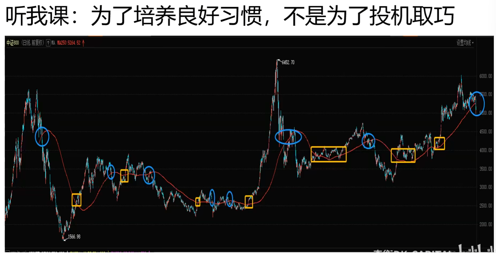

破年线不持有，后续下跌与你无关

年线可以破解很多幻觉

只要本金不死，总能熬到牛市

可以通过权重股是否破年线判断指数是否会破年线

消费品无法参与大国博弈

## 第八课：卖出后继续涨怎么办

### 亚历山大埃尔德《卖出的艺术》

- 移动平均线卖出
- 通道技术卖出
- 压力位卖出

泡沫：个人投资者不认为有风险，处于信息链末端，当接收到信息，已经接近行情末端了。

庄家套你最主要是套住思想。

乖离年线太远了。

个人投资者不建议使用杠杆

投资需要有好的风险收益比。

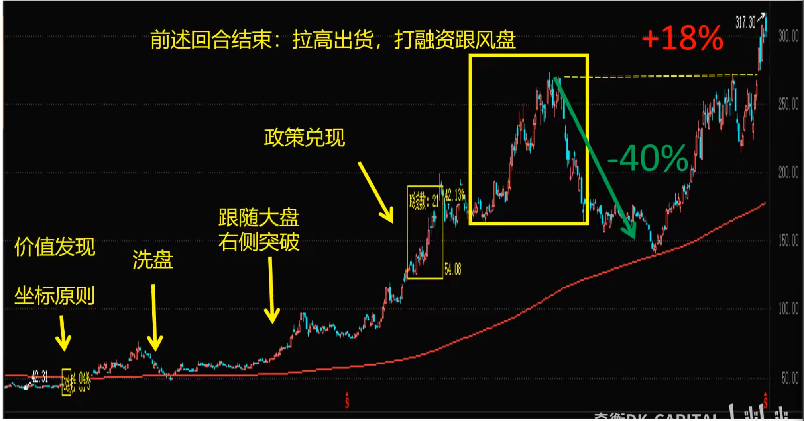

### 通道卖出

二级市场的特征是供需时空交错：

要大量卖出，最佳时机是市场疯狂买入。

要大量买入，最佳时机是市场疯狂卖出。

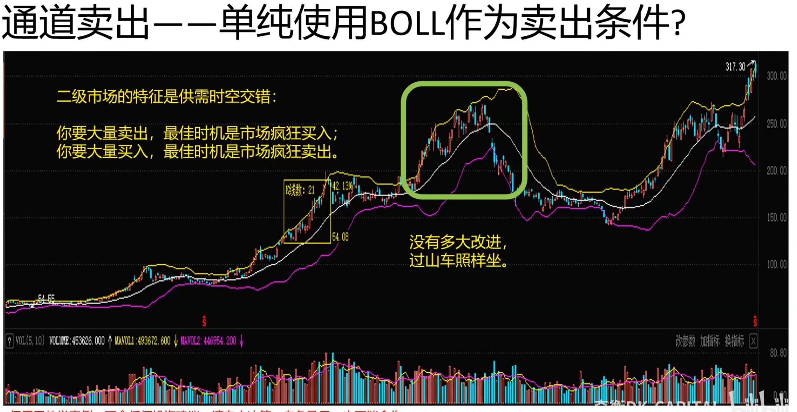

急跌市场卖不掉

### 压力位卖出

万一没有压力位怎么办？

国外品牌打开中国市场，市场销量好，股价有往上走的动力。

特斯拉上海工厂插电开工，跳空可以做。

看特斯拉来做比亚迪

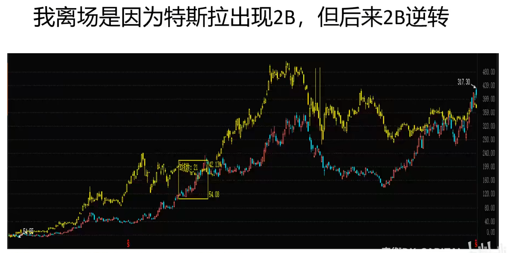

奇衡出来了就不买入了，怕利润回吐

反向坐标原则：

之前是特斯拉带动比亚迪，如果比亚迪背离了原来特斯拉带动的局面，可以通过比亚迪来交易特斯拉。

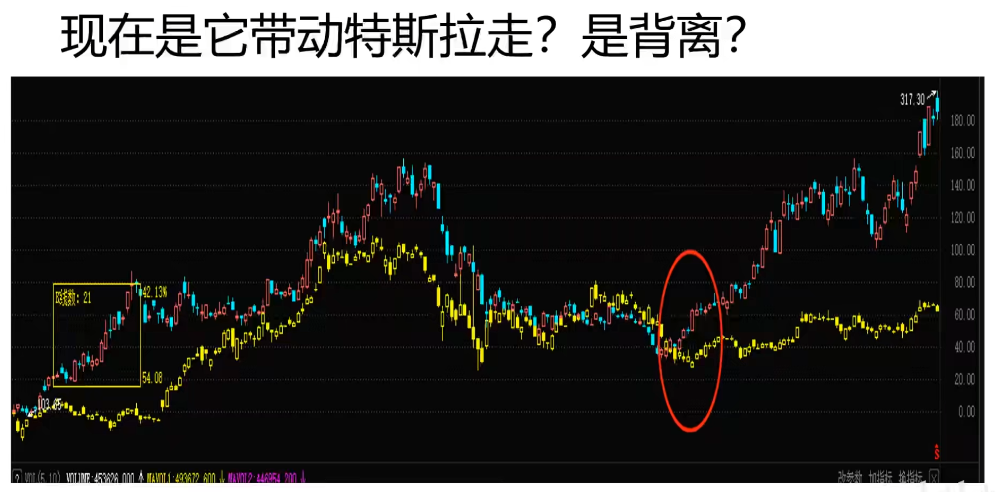

## 第九课：复盘平安

99%的人不适合使用信息不对称赚大钱。

研究预期的不对称而不是信息的不对称。

我十四年投资生涯，其中一个最重要的启示是【知识的价值只有在不断分享的过程中才能体现】。我从我的老师那里无偿继承了《证券分析》及相关的各类投资方法，并成为资本市场的受益者，因此，我内心一直都坚信，作为回馈，我应该无偿地分享我的知识给更多的人。我题目为什么叫“基本面是基本不变的那一面”？这是来自巴菲特的老师——本杰明格雷厄姆的《证券分析》第二章的第二节“定性分析与定量分析”。原文是“For stability means resistance to change and hence greater dependability for the results shown in the past.”其意思是，你的票以及其背后的公司具备某些不易改变的特质，使你分析它的历史数据时能够获得一些在未来也能够适用信息（协助投资决策），即使一切都在不断变化。也就是说，当且仅当你掌握某只票的基本不变的那一面，你才能够在不确定的未来占有优势。一句话：做足功课，才能以不变应万变。

当行情很好的时候，散户会看很长的时间，因为长期来看，一个股票都很便宜。

当有人看40年后的股票价值，需要警惕。

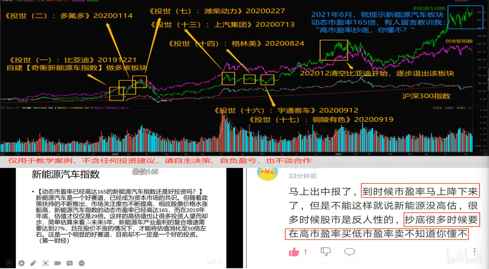

研究银保地券是AH股的基础

投机和交易原则，做空创新高，做多创新低需要止损。

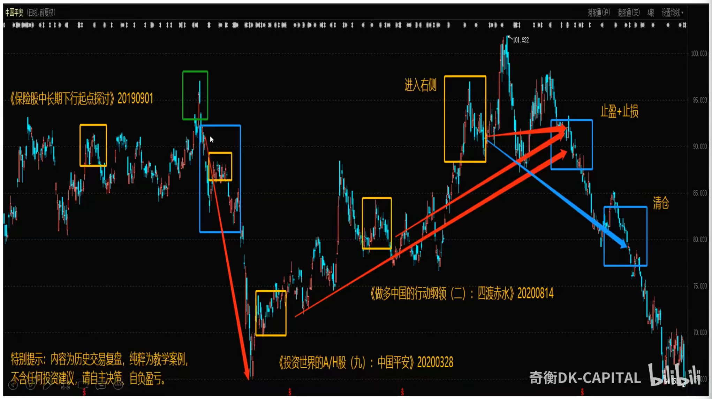

先有基本面的判断，再有技术面，两者一致再做

做空时间需要短，捕捉短期下跌。

长期做空价格非常高。

学习学全面。

金融板块回避房地产带来的债务危机。

长期低利率不利于通胀控制和金融风险识别。

卖出的艺术，功夫在盘外

保险股和利率有关系。

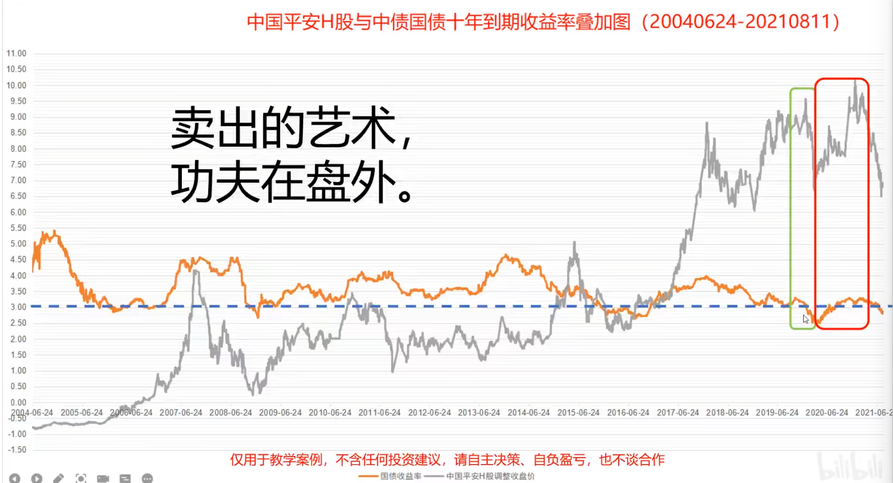

## 第十课：止损六要点，各值一个亿

资金流出的时候不能长期持有

### 关于止损，交易者只需要知道这些

1. 不要把止损位设在大多数人的止损位上
2. 计划持仓时长越大，止损位应该设得很宽
3. 日内交易意味着窄止损，新手应该远离日内交易
4. 记得三重滤网的直观判断辅助
5. 账面有浮盈，设移动保护，宁愿卖飞也要守住
6. 移动保护可以放在交易周期的一个底分型的极点

破年线不能重仓

## 第十一课：从资源指数、金融指数和电价演义复盘来解读中长线投资方法

任何东西都不可能无限上涨，需要跟随国家的引导。

国家的利益：控制通胀，保持稳健货币政策，让实体产业不要受到高利率和高通胀的压力，走出疫情的迷雾，实现产业升级。

控制ppi和cpi的非理性预期。

中长线不要看日线，看周线和月线。

资源类看资源指数。

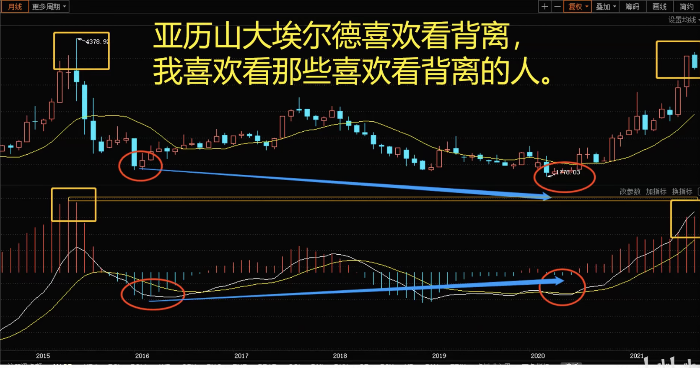

周线价格和macd背离，表明具有资金面，ppi，cpi趋势表明基本面。

顶背离会有人抛，关注风险多于关注机会。

做中长线，务必有足够的钱。

如果有足够的钱，请你务必看看：

（1）基本面

（2）周线月线的中长线资金流动方向

急着重仓甚者ALL IN的人，是排队送死。如果不UBW也不矩，就会厚礼蟹。

中长线捕捉3-5年的机会。

做中长线先找洼池，在成熟的二级市场很难找到洼池。

房地产用来衡量金融业。

银行和房地产相关，券商和房地产不太相关。

明显走低需要小心。

可以通过技术面判断资金面。

### 长线投资，注意三点：

1. 在预期的业绩公告前开始获利了结；
2. 降低对日线级别量价的观察频率；（少看盘）
3. 在长线投资的方向上寻找波段机会。

每天学新概念不适合做波段。

概念出来的时候就是出货的时候。

右侧就是投机。左侧ubw是投资。

同一板块波动不同步，把握住不同步的波段滚和轮动，资金效率非常高。

无法在公告之前预测公告出来后的股价会怎么走。

## 第十二课：期中总结

2%原则规划每一笔单。

往上加仓，越加越少

## 第十三课：投资高手翻车的原因有哪些？

### （一）只关注alpha

收益率=无风险利率+β收益率+α收益率

β收益率来自板块趋势

α收益率来自策略博弈

高手翻车的原因（1）把α收益率的考虑置于β收益率之前

说人话：高手往往一顿操作，玩不过上帝投骰子

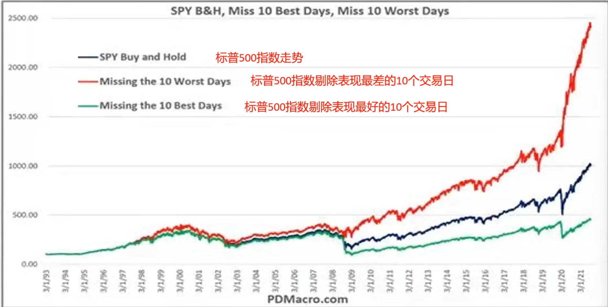

80%的人为了躲避10个最差的交易日错过了10个最好的交易日，盈亏同源。

单纯聚焦于alpha，最终的结果很难控制，一部分底仓获取beta，一部分交易仓获取alpha，就算交易仓一败涂地，底仓也会有所回报。从概率上思考。

标普500指数具有beta，其他指数不一定，需要找一个底仓和交易仓的平衡。

不要因为最坏的情景躲开最好的情景。

不要在一个指数跳来跳去，要在指数之间跳来跳去。

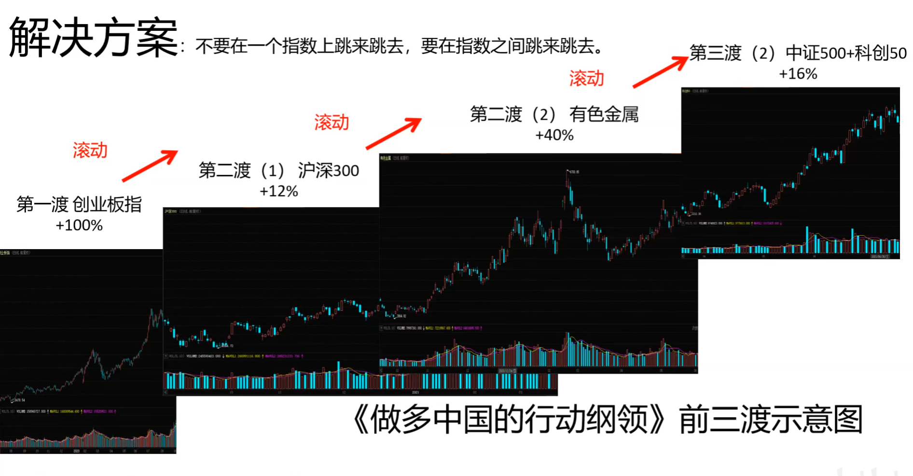

beta不是买入就持有的。除非标普500指数。没有办法事先知道一个指数是否有beta。

把一个指数分解成多个指数，发现其中的关联，让资金在多个指数之间复利，提高收益性。

### （二）明知山有虎，偏向虎山行

不见棺材不落泪。

虎口拔牙，刀刃舔血。

最后，时不利兮骓不逝。

奇衡是平A流

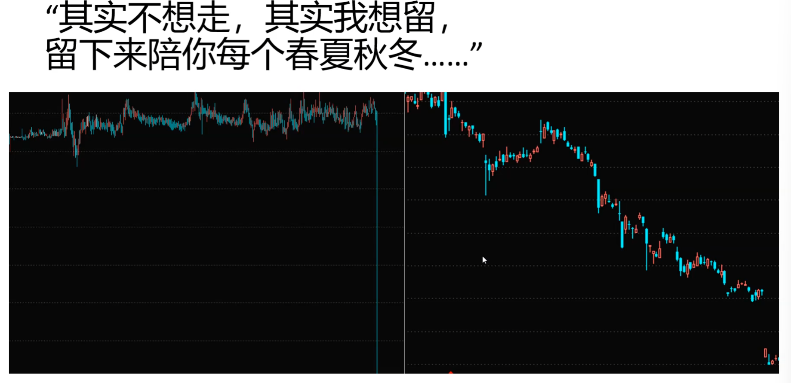

二级市场没什么奇迹。

### （三）沉迷技术面，沉迷于当前的博弈胜负

对**胜率周期**变化的观察窗口太小，对长周期变化毫无免疫。

胜率周期的变化就是利率周期的变化。胜率是会呈周期性变化的。需要在不好的周期休息。

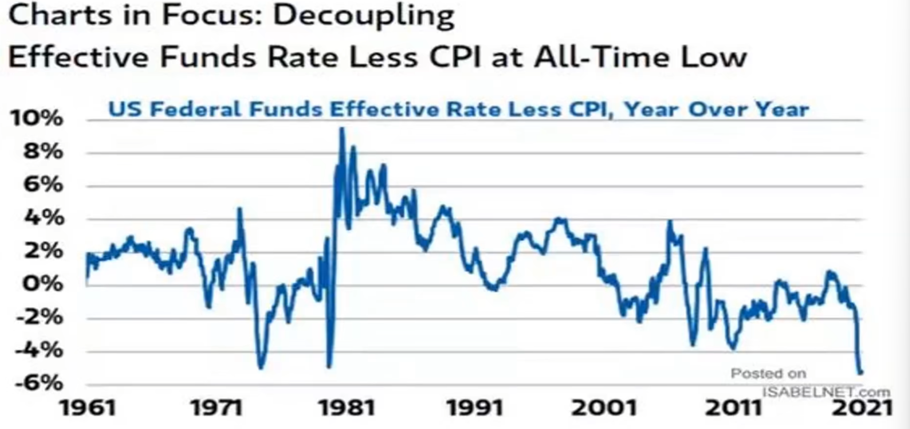

1981年至2021年，联邦利率-cpi常年下降，风险资产疯狂上涨。

不是想认输就认输。

长周期可以跨越40年，长周期的变化发生了，高手不再成为高手。

## 第十四课：一课治愈底部斩仓症

认识并掌握风险，二级市场用潜在回报率

### 顶底不对称

- 买入的主要方式：价值型买入（UBW）和动量型买入（矩型右侧）
- 卖出不能照搬上述两个方式（高估卖出，错；突破卖出，错）
- 因为市场底部窄而短暂（抄底屡胜不可能），顶部宽而持久（做空风险的源头）
- 市场底部由恐惧驱动，主因是多头不能再忍受亏损压力（精神和规则上）而缴械（任意价格出局）
- 恐慌性抛盘又会将不坚定的多头（投机抢反弹）洗出局。一旦他们出局，股价重新上涨（投机性抄底没前途）
- 市场顶部由贪婪驱动，可能比底部更持续，更不规则。逃顶不是逃离顶部，而是逃顶部形成的过程，注定与卖飞同行。

### 以下哪个现象出现时卖出往往是底部斩仓？

A、价格腰斩

B、日线放量大跌

C、出现利好消息

D、价格连续下跌后月线放量

底部：中长线资金进场，承接集中认输的多头筹码。

相近规模的月线级别放量。

低位放量还会继续跌。

跌幅大不代表见底

周期越大越能过滤误导。

### 总结

抄底月线放量

## 卖艺结局篇，如何判断交易策略是否可行

量化方法要有一个系统，并且用各种指标来判断是否可行

卖艺结局篇预计有上中下三课，解决一个问题

学生：奇衡DK老师（注：奇，出奇制胜的“奇”），我的交易方法遇到单笔交易大亏、连续数次亏损甚至持续一段时间亏损，我是应该停手还是继续？

我：以交易为生的人，本金亏完就失业。请反复刷卖艺结局篇，找出适合自己的可持续交易策略，并量化地了解自己的策略。

宁愿放假也要有确定性，本金安全是第一位，其他问题都可以用策略来解决

策略有问题，需要赶紧修改。策略没问题，只是短期不适合市场，需要休息，并坚持。

对自己的策略没信心就不能以交易为生。

投资不需要花所有时间去做。

不要辞职炒股。

做历史回测，不要用本金去市场实验自己的方法对不对。

新手可以做模拟盘。

历史样本回测--蒙地卡罗测试--样本外测试--实盘测试--实盘

历史样本分为测试集和验证集，奇衡使用非参模型。

蒙地卡洛模拟：**成千上万**次随机波动结构测试，看策略的韧性。

计算机产生的数是伪随机数。

### 样本测试的关注指标

| 名称             | 含义                                              | 备注                                                                                                 |
|----------------|-------------------------------------------------|----------------------------------------------------------------------------------------------------|
| 净利润            | 统计测试内策略所获取盈利或损失的总额                              |                                                                                                    |
| 总盈利（盈利）        | 策略每笔盈利总额                                        |                                                                                                    |
| 总亏损（毛损）        | 策略每笔亏损总额                                        | 总亏损的减少也能增加利润                                                                                       |
| 盈利因子（利/毛损）     | 总盈利/总亏损，也称盈利比。                                  | 数值越大，代表盈利能力越强，接近1需要改                                                                               |
| 收益率            | 净利润/期初资产                                        |                                                                                                    |
| 年化收益率          | 净利润/交易时间。不足一年，以（自然日/365）处理。策略收益率低于无风险收益率可以考虑放弃。 |                                                                                                    |
| 最大资产回测         | 策略资产曲线出现一个新的高点后，此高点与后续低点之间的最大回撤。                | 通过这个统计值，可以知道我们的交易数量下需要承受多大的回撤金额。                                                                   |
| 净利润/最大资产回撤     | 统计期内获得利润与承受风险的比率                                | 又称恢复因子，这是考虑风险与回报关系的一个重要指标。                                                                         |
| 最大资产回撤幅度       | 方法与最大资产回撤相似，区别在于以百分比表示                          | 强平、爆仓风险来自于这个回撤幅度。通过这个统计值，可以检视自己在心理、资金上能够忍受多大的资产回撤幅度。                                               |
| 年化收益率/最大资产回撤幅度 | 考察让资产平均每年增值的幅度与需要承受的最大资产回撤幅度的比率                 | 这个指标数值越大，代表策略风险调整后的收益能力越强。最好大于2。                                                                   |
| 交易次数=平仓次数      |                                                 | 多空不平衡的策略不要做。                                                                                       |
| 盈利交易次数         | 盈利交易是指平仓差价产生的毛利减去开平仓交易成本（包括佣金、滑点）依然有利润的交易。      |                                                                                                    |
| 亏损交易次数         | 亏损交易是指平仓差价产生的毛损加上开平仓交易成本（包括佣金、滑点）依然有亏损的交易。      |                                                                                                    |
| 胜率             |                                                 | 在30%-50%                                                                                           |
| 平均盈亏           | 每次交易的盈亏额的平均值                                    | 仅用于每次交易固定手数或金额的系统                                                                                  |
| 平均盈利           | 总盈利/盈利交易次数                                      |                                                                                                    |
| 平均亏损           | 总亏损/亏损交易次数                                      |                                                                                                    |
| 盈亏比            | 平均盈利/平均亏损                                       | 趋势交易追求高盈亏比，用多次小的试错成本换来一次大的盈利。不同风格的交易策略，或偏好高胜率，或偏好高盈亏比，长线趋势性系统，高盈亏比，短线震荡系统，盈亏比相对较低。找一个长线和短线中间的持仓时间。 |
| 最大连续盈利         | 最大连续盈利是指在统计期内，连续盈利交易的总和。                        | 可以考虑在连续盈利接近最大连续盈利时，减轻每次交易投入资金。                                                                     |
| 最大连续亏损 | 最大连续亏损是指在统计期内，连续亏损交易的总和。                      | 可以考虑在连续亏损接近最大连续亏损时，增大每次交易投入资金。 |
| 平均持仓时间 | 平均持仓时间是指在统计期内，所有交易的持仓时间的平均值。      | 考察策略偏长线或是短线。                   |
| 平均盈利周期 | 平均盈利周期是指在统计期内，所有盈利交易的持仓时间的平均值。 | 考察盈利交易是否需要耐心持有。                |
| 平均亏损周期 | 平均亏损周期是指在统计期内，所有亏损交易的持仓时间的平均值。 | 考察亏损交易是否需要及时平仓。                |
| 去离群总盈利 |  | 考察策略在一般情况下的盈利能力。去除离群盈利交易产生的总盈利。离群盈利交易是指平均盈利在 n 倍标准差之外的盈利（小概率发生的交易）。如果去离群总盈利与总盈利差距过大，说明大部分盈利来自于小概率交易。（n一般设3倍） |
| 去离群总亏损 |  | 考察策略在一般情况下的亏损情况。去除离群亏损交易产生的总亏损。离群亏损交易是指平均亏损在 n 倍标准差之外的亏损（小概率发生的交易）。如果去离群总亏损与总亏损差距过大，说明大部分亏损来自于小概率交易。（n一般设3倍）解决离群总亏损大的问题，可以大幅减少亏损。 |
| 总盈利因子与去离群总盈利因子 |  | 总盈利因子与去离群总盈利因子的差距越大，说明策略的盈利能力越依赖于小概率交易。 |
| 最大单盈/总盈利 |  | 若该值较高，系统实际盈利能力和稳定性不高。 |
| 最大单亏/总亏损 |  | 若该值较高，这次最大亏损是否是这个策略的“黑天鹅”。 |
| 净利润/最大单亏 |  | 该值的绝对值越高越好。 |
| 佣金合计 | 包括手续费，股票托管费等交易费用 |  |
| 滑价成本 | 历史回测测试时假设的滑价，或者实际交易中滑价导致的交易成本 | 成本决定频率 |
| 月化收益率 | 采用几何平均法计算月化收益率 |  |
| 月平均收益 | 净利润/统计期间月数 |  |
| 月收益标准差 | 每个月净利润的标准差 |  |
| 月收益率标准差 | 统计每月资产收益率的标准差 | 标准差越小表示资产曲线越平滑 |
| 最大回撤发生期 | 回撤金额最大的起止时间 |  |
| 最大回撤资产幅度发生期 | 回测幅度最大的起止时间 | 检视自己在心理、资金上能忍受多大的资产回撤幅度 |
| 最大平仓交易回撤发生期 | 平仓时从资产高峰到低谷的起止日期 |  |
| 最大平仓交易回撤幅度 | 以百分比计量回撤幅度 |  |
| 最大平仓交易回撤幅度发生期 | 以百分比计量回撤幅度而不是回撤金额 |  |
| 净利润/最大资产回撤 |  |  |
| 净利润/最大平仓交易回撤 |  |  |
| 年化收益率/最大资产回撤幅度 |  |  |
| 有效年化收益率/最大资产回撤幅度 |  |  |
| 年化收益率/25%最大资产回撤幅度的平均值 |  |  |
| 月化收益率/月收益标准差 |  |  |
| ULCER指数 |  | 仅考量波动向下的情况 |
| 夏普比率 |  | 承担的一单位风险带来的收益 |
| 索丁诺比率 |  |  |
|总交易时间|测试时间中的天数总计||
|持仓时间|有持仓的天数总计||
|持仓时间%|有持仓的天数总计|持仓时间/总交易时间|
|最大空仓时间|两次交易之间的最大间隔||
|总交易月数|总交易期间换算成月数量||
|盈利月数|交易期资产增值的月数量||
|平仓资产增值天数|统计当天收盘比前一天资产增值的天数||
|平仓资产减值天数|统计当天收盘比前一天资产减值的天数||
|获利日占比|资产增值天数/总交易时间||
|最大持仓数量|统计历史上曾经的最大的持仓合约数||
|最大占用资金|统计历史上最大投入的资金额，开仓到最大仓位时投入的资金||
|平均仓位|对每根K线取样计算持仓占用的资金/资产的百分比平均值，仓位意味着风险敞口，该百分比越高，表示资产暴露给市场波动风险的程度越高，也表示在市场上投入资金量越大，机会成本越大，没有更多的资金投入其他地方||

出手之前务必知己知彼

**一个策略固定交易手数，多个策略一起达到仓位控制的效果。**

