# 约翰涅夫三十年

## 第一课：以出货为目的进货

进入一个赛道要有第一手数据。

>如果确定能去到终点的工具是过山车，那么我会毫不犹豫地上车。

高度和高速是天花板和波动

没有一帆风顺的创业路

衡量式参与

生意不等于盈利

需要模式契合以及接受短暂不盈利

研究问题通过概念转换化繁为简

>我喜欢有自主性和富有挑战性的工作。所有的一切好与坏都是我自己的决定，这种感觉不断地促使我努力工作。我早上出门，在路上就是一整天，半夜我在加油站地停车场睡觉，天亮后再出发去下一个城市（以销售为生）
>多年后，他成为了公司举足轻重的经销商，并在公司老板去世后从其家族手里买下了公司两大工厂，创立乐事

深耕有需求的地方，所以他跟乐事公司有议价权。

在有鱼的地方打鱼，先确定买家在哪里才去进货

作为经销商，首先应该了解市场。知易行难

做生意：输家看货，赢家看人

市场需求旺盛的商品，即使你不喜欢、不看好，这生意也可以做

市场需求冷淡的商品，即使你很喜欢、很看好，这生意碰不得。

**不要把做生意变成做收藏。**

## 第二课：便宜才是硬道理

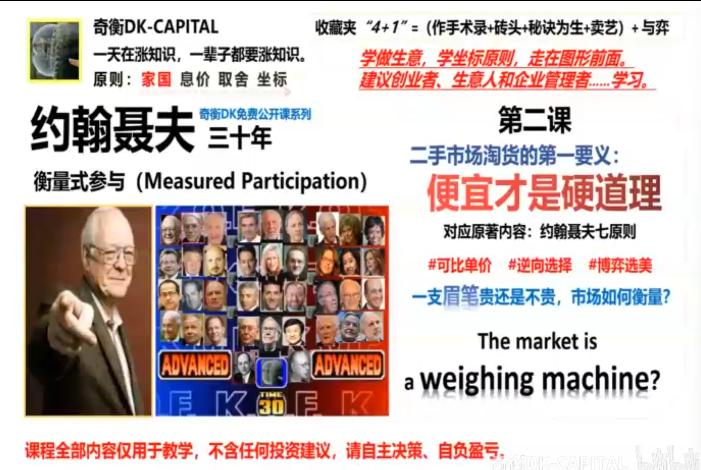

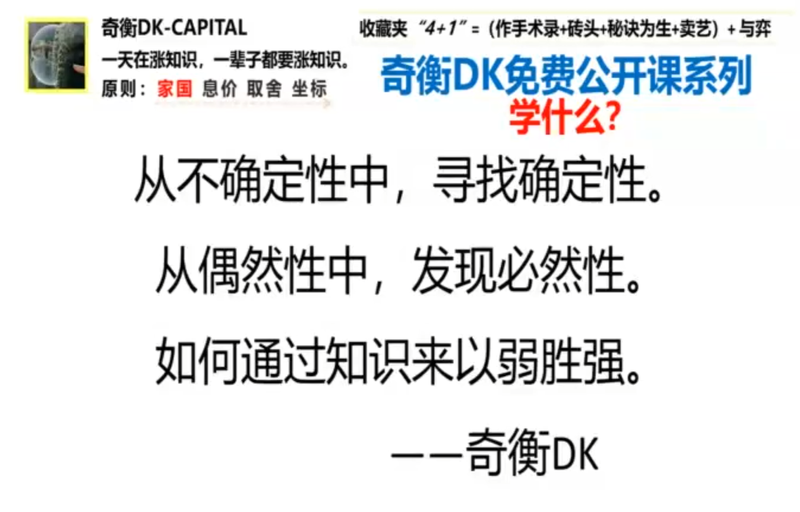

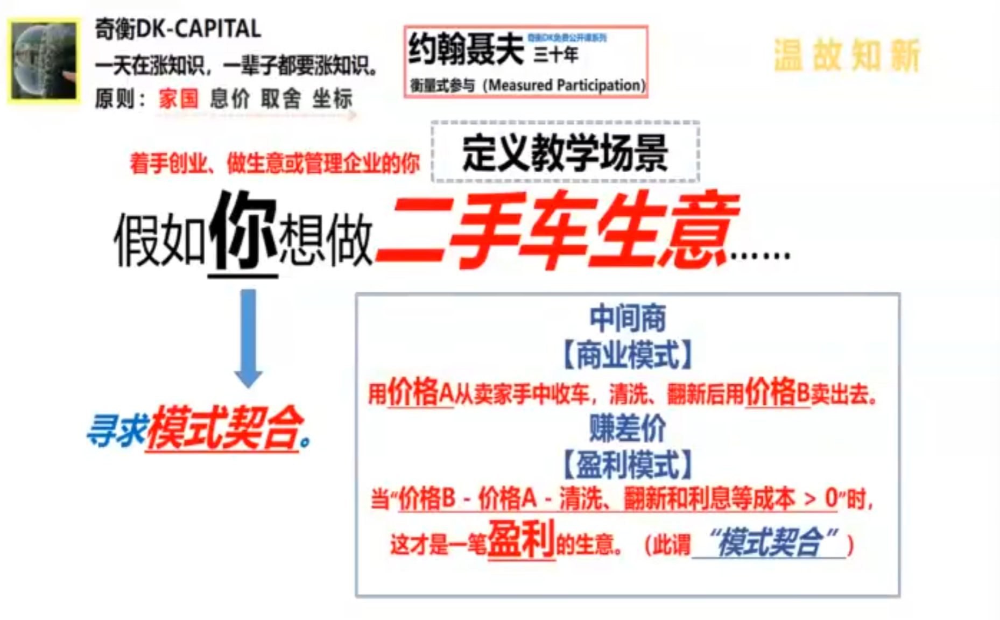

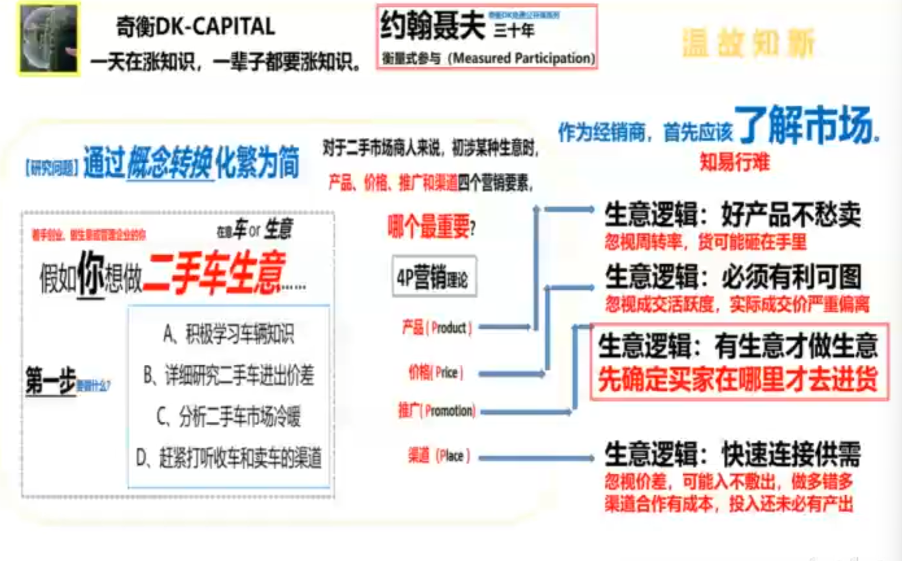

作为经销商，首先应该了解市场

做生意：输家看货，赢家看人

便宜：特指价格小于价值，而不是价格数值看起来比较小

判断价格是否小于价值的时候，最大的难点在于，价值看不见摸不着，而且价值大小见仁见智

价值就像幽灵，人人都说能感知它、都在讨论它，但没有人真正看见过他。

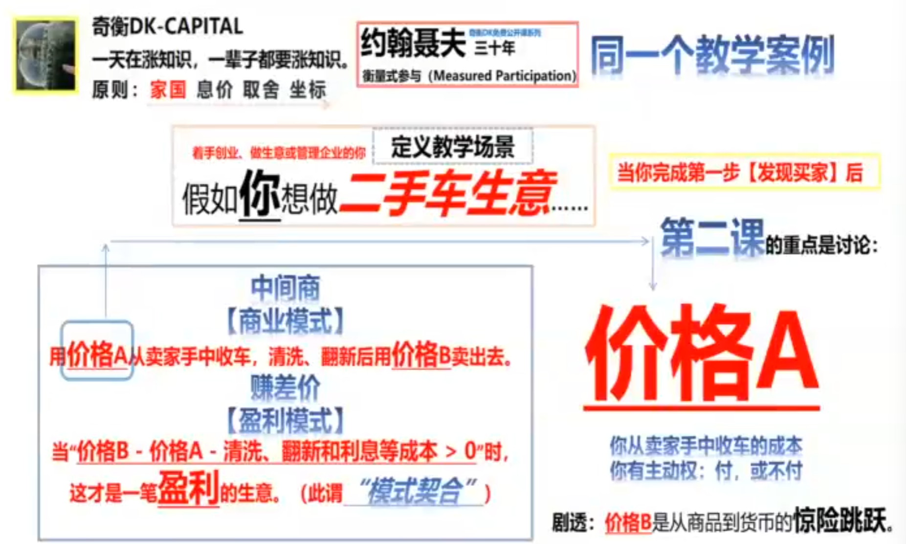

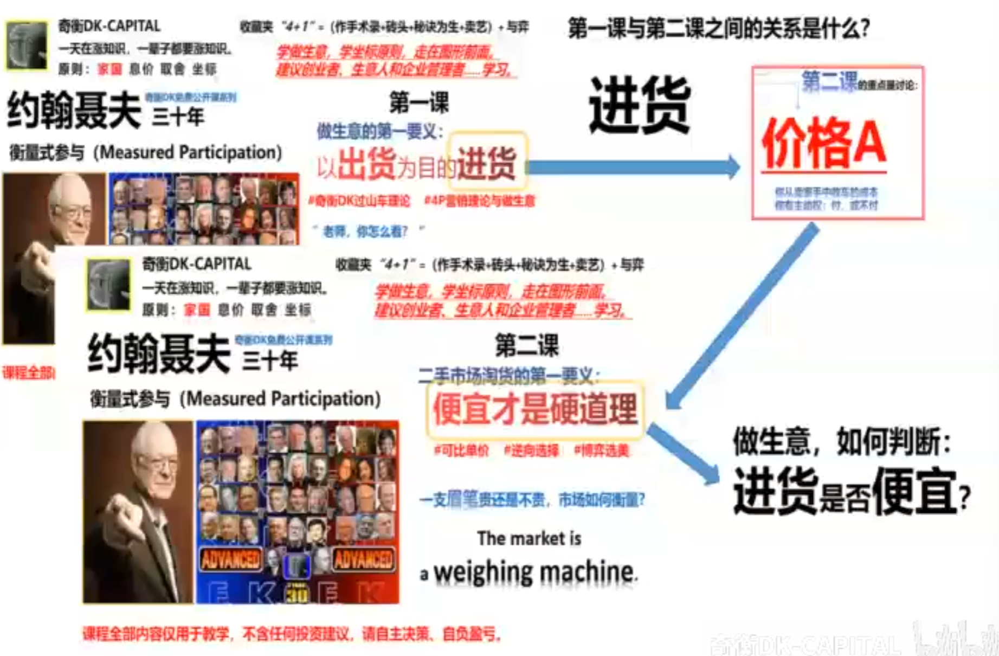

做生意，如何判断：进货是否便宜？

要知道商品是贵还是便宜，不是看总价，也不是看单价，而是要看可比单价

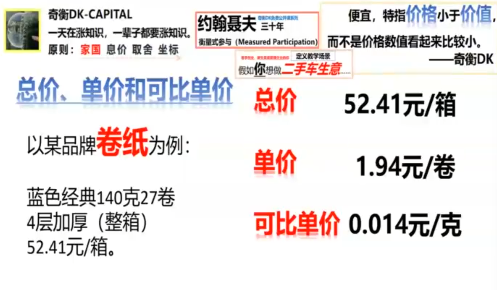

买的不是卷，而是纸

仅知道单价，无法判断贵还是不贵

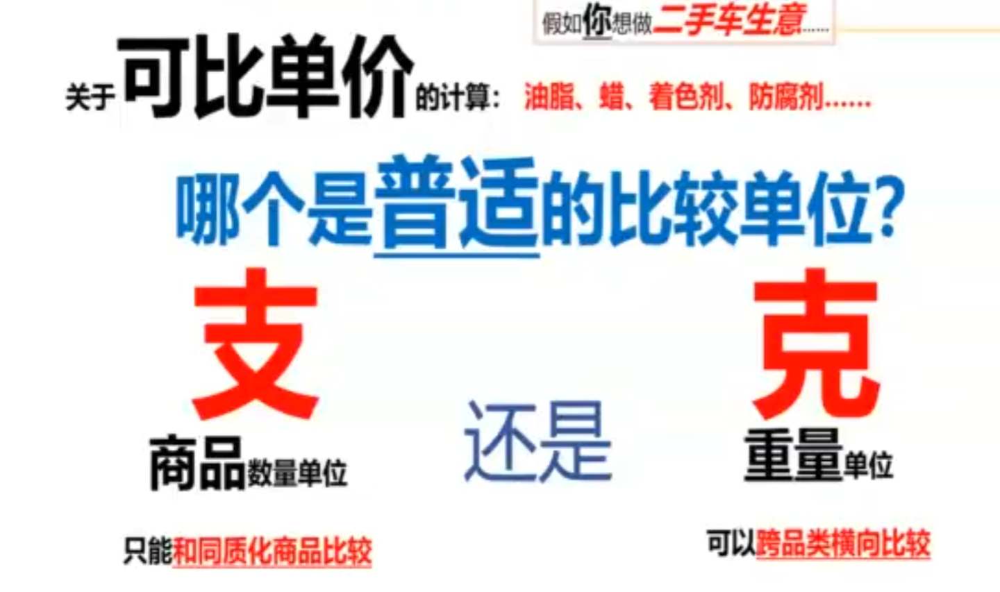

可比单价=总价/公认标准数量

元/克=总市值/总盈利

逆向选择，过程：卖家不断算计买家
结果：二手市场变成了充斥着次品的垃圾场

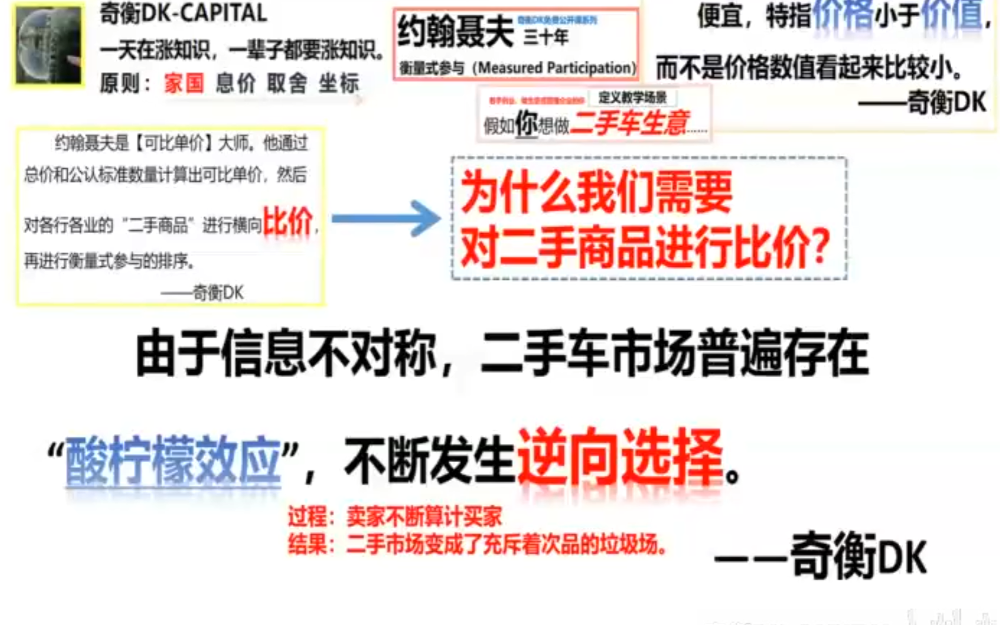

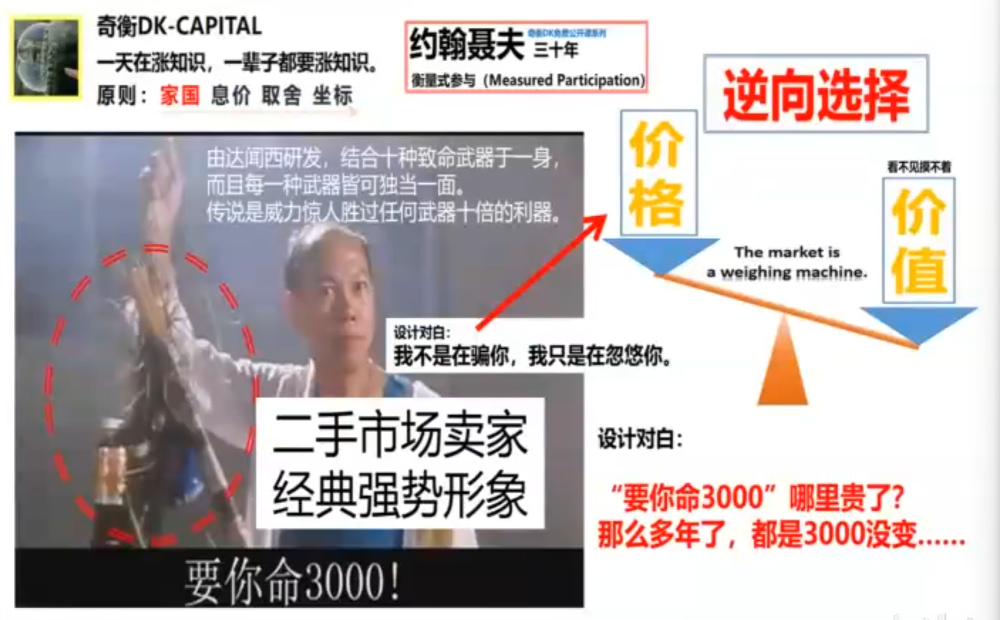

价值是无法衡量的，价格是卖家报价的

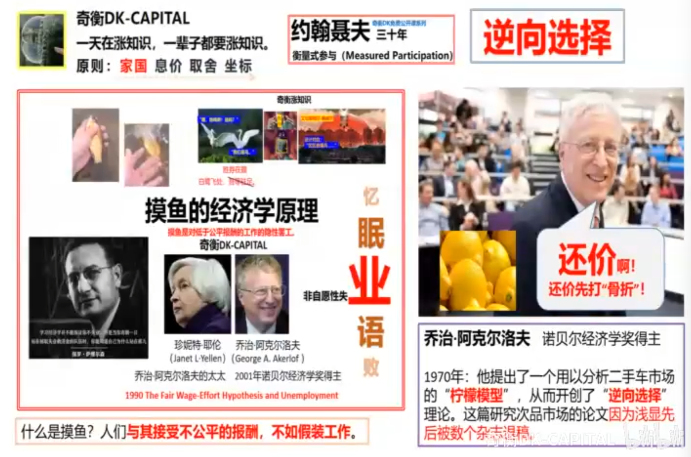

安全边际是还价还出来的

卖的人往往比买的人更懂->买家不能贸然接受卖家报价

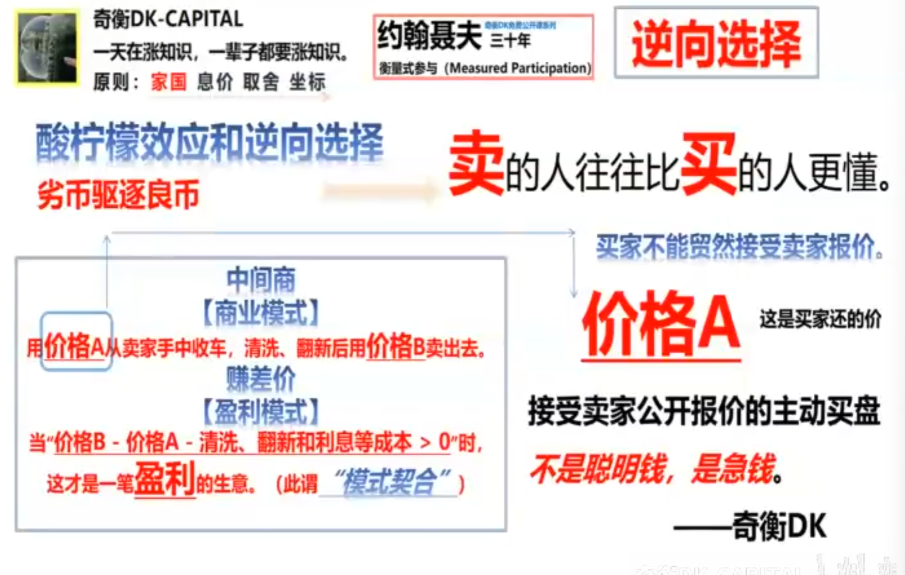

接受卖家公开报价的主动卖盘，不是聪明钱是急钱

二手市场里面，必须懂压价

最聪明的买家，等耐用品大幅打折清仓时出手。

次聪明的买家，会与卖家讨价还价，耐心等待。

平庸的买家，卖家报什么价都随行就市接受。

愚蠢的买家，溢价抢购和囤积快速消费品

二手市场淘货成功的关键词

压价、清仓、耐心、耐用品、讨价还价

对于货需要货比三家，买家不需要懂货，只需要比货

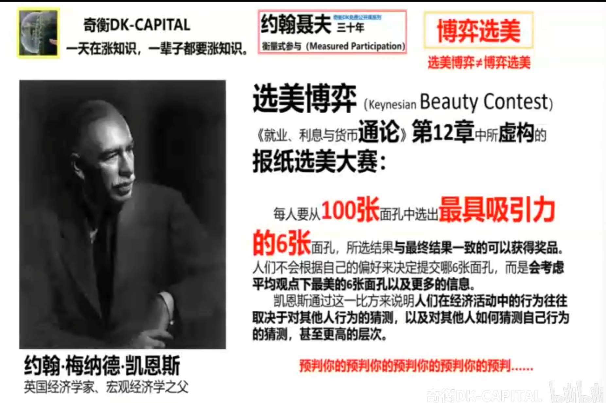

如何通过制定规则去调节引导大众

经济学家不是科学家，而是为了引导公众行为而公开阐述观点与逻辑的游说家

用模糊的标准引导大众跟风，谁带起了风就能把控大众的群体行为。

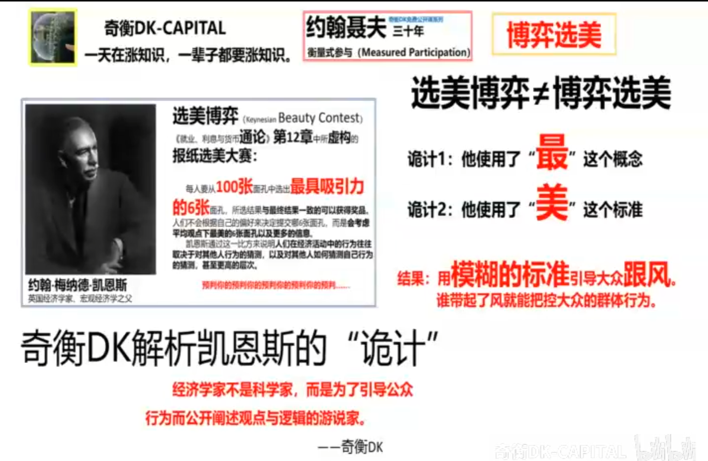

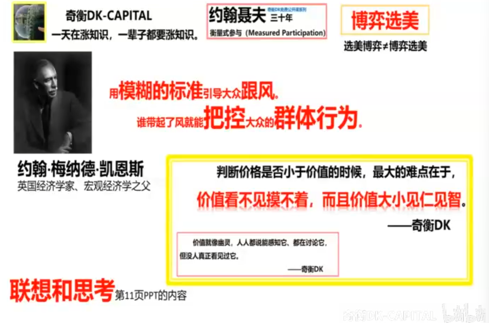

价值是二手市场混沌的根源，因为它事实上是特定时空下的投票结果

用模糊的标准引导大众跟风。谁带起了风就能把控大众的群体行为。

怎样在二手市场把“选美博弈”扭转为“博弈选美”？

盯着特定市场的最大受益者，而不是大众参与者。不要浪费时间揣摩大众的想法，也不要盲目跟风。真正要花时间关注的是最大受益者现在是买家还是卖家

